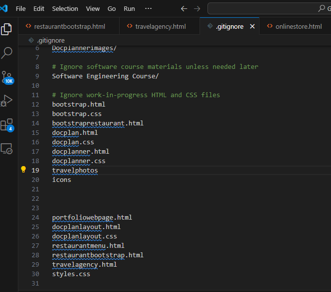

# Version Control System (VCS), Git, and GitHub – A Learning Repository

Welcome to the **VCS_git_github** repository! This project serves as a comprehensive learning log and practical demonstration of key concepts in **Version Control Systems**, with a special focus on **Git** and **GitHub**. It contains basic to intermediate-level commands and explanations, as well as real-use cases executed via Git Bash.

---

## 🧠 Objective

This repository was created to:

- Understand the basics and benefits of Version Control Systems (VCS)
- Learn and practice core Git commands (initialization, staging, commits, branching, merging, etc.)
- Explore collaboration using GitHub (remote repos, pull requests, forks, issues, etc.)
- Identify and document challenges encountered as a beginner

---

## 📂 Contents

- `notes.md` – Written explanations and commands
- Git Bash command screenshots (in `/Image`)
- GitHub repository interactions and usage examples
- Challenges encountered and how they were solved (see below)

---

## 🛠️ Tools Used

- Git CLI (Git Bash)
- GitHub (for remote collaboration and hosting)
- VS Code (for editing markdown and code)

---

## 📸 Screenshots

Here are a few screenshots taken during the learning process using Git Bash:

- You can check out some practical step-by-step examples here

🔗 **Related Repo:** [learn_git](https://github.com/David-Francis-Effiong/learn_git)

## 📸 Git Workflow challenges Screenshots

<table>
  <tr>
    <td align="center">
       Git Push Challenge
    </td>
    <td align="center">
       Failed to remove file
    </td>
    <td align="center">
       Git Merge
    </td>
    <td align="center">
       Git Ignore
    </td>
    <td align="center">
       Rename Branch
    </td>
  </tr>
</table>
